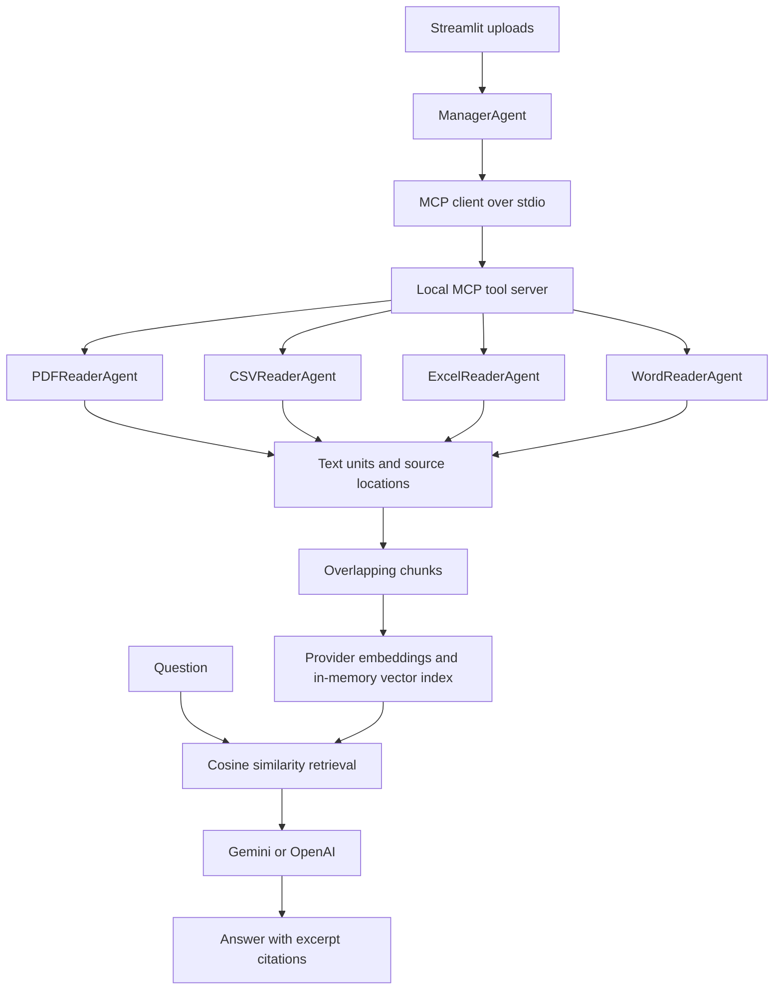

# AI Document Scanner using MCP Tools + RAG with Python

**Student:** Shreya Baidya  
**Project:** Final Project using Agentic AI  
**GitHub link:** https://github.com/smartgameboy/ai-document-scanner

A Streamlit application that reads PDF, CSV, Excel and Word documents, retrieves relevant passages using semantic embeddings, and answers questions using Gemini or OpenAI with source references.

## Run locally

Use Python 3.11 or newer. In this project folder:

```bash
python -m venv .venv
source .venv/bin/activate
# Windows: .venv\Scripts\activate
pip install -r requirements.txt
cp .env.example .env
streamlit run app.py
```

Enter an API key in the sidebar or set it in `.env`. Select your provider, upload files, click **Build document index**, then ask a question. Answer and embedding model IDs are editable. Default IDs are examples and require account access. Provider API charges may apply. The MCP subprocess starts automatically; no separate server command is required.

## Architecture



| Format | Specialist | MCP tool | Source reference |
|---|---|---|---|
| PDF | PDFReaderAgent | read_pdf | Page |
| CSV | CSVReaderAgent | read_csv | Logical record |
| XLSX | ExcelReaderAgent | read_excel | Sheet and row |
| DOCX | WordReaderAgent | read_docx | Paragraph or table row |

The manager chooses a specialist by file extension, invokes an actual MCP tool, collects results, and isolates file-level failures. These are deterministic specialist components, not four independent LLMs. The LLM performs grounded answer generation; the manager controls the workflow. The vector store uses normalized embeddings and NumPy cosine similarity. It is rebuilt per Streamlit session and is not persisted.

## Project files

- `app.py`: upload interface, settings, chat and source viewer.
- `manager.py`: MCP client, routing, chunking and RAG index.
- `mcp_server.py`: four registered MCP tools.
- `readers.py`: format-specific extraction.
- `providers.py`: Gemini/OpenAI embedding and answer adapters.
- `tests/test_project.py`: extraction, retrieval and real MCP integration checks.

## Demonstration

1. Upload a PDF report and a CSV with labelled columns.
2. Show the manager routing log.
3. Ask: “What does the report say about the project objective?”
4. Expand retrieved evidence and compare the cited page or row.
5. Ask a question absent from the documents and assess the model's uncertainty.
6. Upload a malformed file with a valid file and demonstrate isolated failures.

## Scope and limitations

- PDF means selectable text. Image-only scans need OCR, which is not included.
- Excel supports `.xlsx`, not legacy `.xls`. First row is treated as headers; cached formula values are read, formulas are not calculated.
- CSV requires UTF-8 and uses logical record numbers, which can differ from physical lines for quoted multiline values.
- DOCX body paragraphs and tables are extracted. Images, headers, footers, tracked changes and text boxes are not extracted.
- Each question is independent; displayed conversation history is not sent as model context.
- Retrieved passages are evidence samples. This is not an engine for exact full-table sums or exhaustive document summaries.
- Citation labels are requested through prompting; their correctness is not guaranteed and should be checked against the evidence viewer.
- Limit: 10 files, 20 MB each, 3,000 chunks. Very large or adversarial compressed documents may still exhaust resources; use trusted files for this local academic prototype.
- Text is sent to the selected cloud provider. API keys remain in local process/session memory and are not written by the application. Exclude `.env` when publishing.
- The MCP SDK is constrained to the supported v1 API (`<2`) to match the stdio/FastMCP imports.

## Tests

```bash
python -m pytest -q
```

Tests do not need provider keys. They use local fixtures and a fake embedding provider; the MCP test launches the real local server. Live generation and embeddings require a valid key and network access.

## GitHub publication

Create an empty GitHub repository named `ai-document-scanner`, then run the following inside this folder, substituting your real remote URL:

```bash
git init
git add .
git commit -m "Add AI document scanner with MCP and RAG"
git branch -M main
git remote add origin YOUR_GITHUB_REPOSITORY_URL
git push -u origin main
```

Add the resulting repository URL to the project submission. Project repository: https://github.com/smartgameboy/ai-document-scanner

## Official implementation references

- [MCP Python SDK v1 documentation](https://py.sdk.modelcontextprotocol.io/v1/)
- [Gemini Python SDK quickstart](https://ai.google.dev/gemini-api/docs/quickstart)
- [Gemini embeddings](https://ai.google.dev/gemini-api/docs/embeddings)
- [OpenAI embeddings](https://developers.openai.com/api/docs/guides/embeddings)
- [OpenAI text generation](https://developers.openai.com/api/docs/guides/text)
